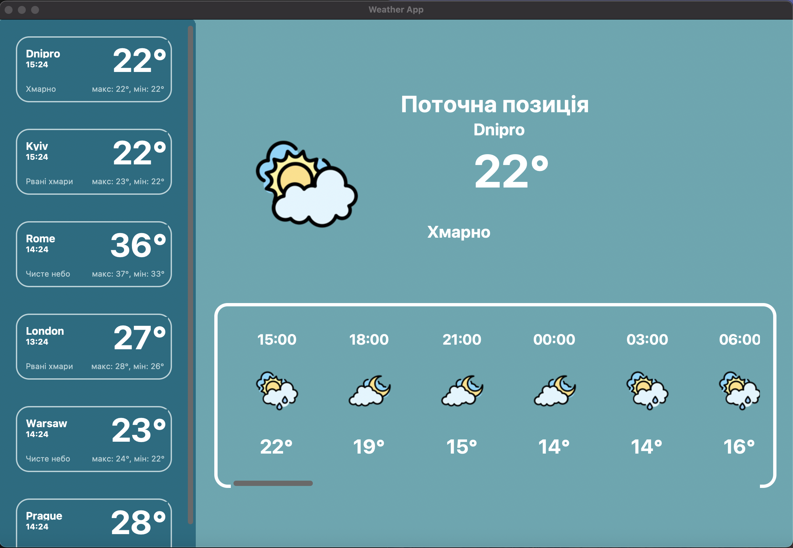

# Weather application



Цей проєкт розроблено з метою ознайомлення з роботою API, принципом отримання даних від віддаленого серверу, вмінням їх обробляти, структурувати та застосовувати у своєму проєкті. Застосовується API веб-ресурсу [OpenWeatherMap](https://openweathermap.org). 

Проєкт допоможе розібратися з роботою JSON-файлів, навчить отримувати й зберігати дані у форматі `.json`. Також демонструється створення сучасного графічного інтерфейсу за допомогою [CustomTkinter](https://customtkinter.tomschimansky.com).

---

### Зміст репозиторія:

1. [Основні модулі проєкту](#all-modules)
2. [Розгортання проєкту](#download-project)
3. [Створення віртуального оточення проєкту](#create-venv)
4. [Завантаження модулів до віртуального оточення](#download-modules-venv)
5. [Старт проєкту](#start-project)
6. [Основні механіки проєкту](#all-mechanics)
7. [Висновок по проєкту](#result)

---
<h4 id='all-modules'>Основні модулі проєкту:</h4>

- [customtkinter](https://customtkinter.tomschimansky.com/)
- [json](https://docs.python.org/3/library/json.html)
- [requests](https://pypi.org/project/requests/)
- [pillow](https://pypi.org/project/Pillow/)
- [os](https://docs.python.org/3/library/os.html)
- [colorama](https://pypi.org/project/colorama/)
- [datetime](https://docs.python.org/3/library/datetime.html)

---
 <h4 id='download-project'>Розгортання проєкту:</h4>

#### 1. Клонування з GitHub:
```bash
git clone https://github.com/SaberWQ/Weather_App.git
cd Weather_App
````

#### 2. Завантаження архіву:

* Натисніть кнопку `Code` > `Download ZIP`, розпакуйте в зручну директорію.

---

<h4 id='create-venv'>Створення віртуального оточення проєкту:</h4>

#### Windows:

```bash
python -m venv venv
venv\Scripts\activate
```

#### macOS / Linux:

```bash
python3 -m venv venv
source venv/bin/activate
```

---

<h4 id='download-modules-venv'>Завантаження модулів до віртуального оточення:</h4>

#### 1. Встановлення через `requirements.txt`:

```bash
pip install -r requirements.txt
```

#### 2. Або вручну:

```bash
pip install customtkinter requests pillow colorama
```

---

<h4 id='start-project'>Старт проєкту:</h4>

```bash
python main.py
```

Після запуску відкриється графічне вікно застосунку, в якому можна вводити назву міста й отримувати актуальну інформацію про погоду.

---

<h4 id='all-mechanics'>Основні механіки проєкту:</h4>

* Запит до OpenWeatherMap API для отримання погодних умов.
* Вивід інформації (температура, стан неба, вологість тощо) у зручному форматі.
* Можливість зміни міста введення.
* Інтерфейс, адаптований під різні платформи.
* Завантаження зображень/іконок відповідно до погоди.

---

<h4 id='result'>Висновок по проєкту:</h4>

Цей застосунок є чудовим стартом для ознайомлення з:

* API-запитами та роботою з JSON.
* Базовим GUI на Python з використанням `CustomTkinter`.
* Організацією структури Python-проєкту.
* Підключенням та обробкою ресурсів (іконки, фонові зображення).

Проєкт може бути розширений функціями на кшталт прогнозу на кілька днів, перемикання одиниць виміру, підтримки багатьох мов тощо.

---

**Розробник**: [SaberWQ](https://github.com/SaberWQ)

Ласкаво просимо до використання та вдосконалення проєкту!

🟦 Висновок по проєкту
Проєкт Weather App є ефективним прикладом інтеграції стороннього API (OpenWeatherMap) у десктопний застосунок із графічним інтерфейсом. Він демонструє ключові навички сучасного Python-розробника:

робота з HTTP-запитами та API;
парсинг та обробка даних у форматі JSON;
створення адаптивного GUI за допомогою бібліотеки CustomTkinter;
організація структури Python-проєкту та управління залежностями через віртуальне середовище.
Цей застосунок може слугувати базовим шаблоном для створення подібних програм, а також бути основою для розширення функціоналу (наприклад: додавання прогнозу, підтримки геолокації, кешування даних тощо).

У результаті роботи над проєктом було отримано практичний досвід створення повноцінного застосунку — від ідеї до реалізації та тестування.


```
